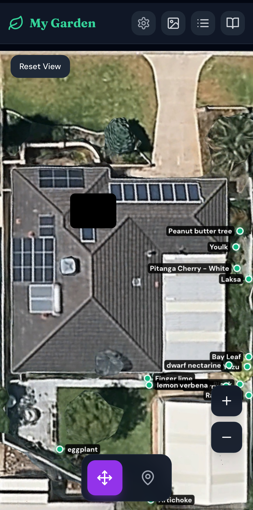
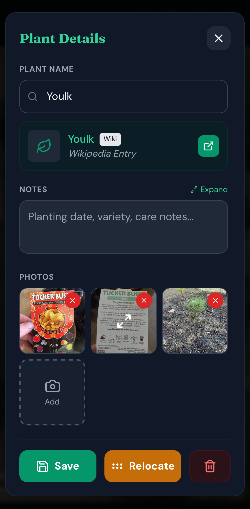
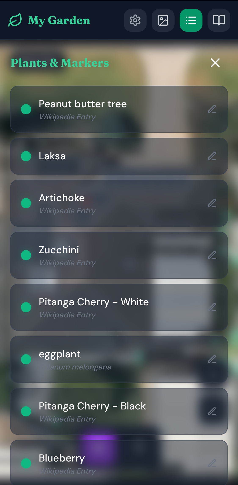
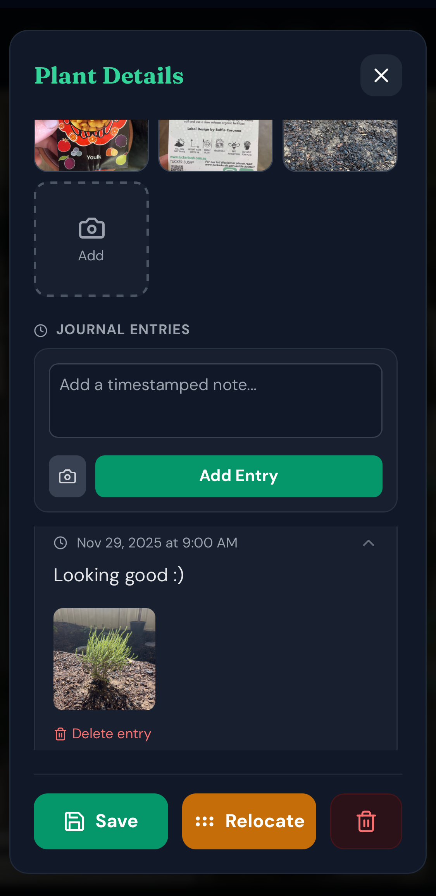

# 🌿 Self-Hosted Garden Planner

A mobile-first, drag-and-drop garden planning application designed for self-hosting. Design your layout, track plant growth, and maintain a visual journal of your garden's progress.



## ✨ Features

* **📱 Mobile First Design:** Smooth panning, zooming, and touch interactions optimized for phones and tablets.
* **📍 Drag & Drop Planning:** Easily place plant markers on your floorplan or aerial photo.
* **📸 Photo Journal:** Attach photos to specific plants or create global journal entries.
* **📖 Wikipedia Integration:** Automatic lookup for plant care info and images.
* **💾 Local & Private:** 100% self-hosted. Your garden data stays on your server.
* **🔍 Full Screen Viewer:** High-quality image viewer for inspecting plant health.

## 🖼️ Gallery

| Plant Details | Plant List |
|:---:|:---:|
|  |  |

### Visual Journal Timeline


## 🚀 Quick Start

### Prerequisites
* Docker & Docker Compose

### Installation

1.  **Clone the repository**
    ```bash
    git clone [https://github.com/krisvanlog/garden-planner.git](https://github.com/krisvanlog/garden-planner.git)
    cd garden-planner
    ```

2.  **Run with Docker**
    ```bash
    docker compose up -d --build
    ```

3.  **Access the App**
    Open `http://<your-server-ip>:8090`

## 🛠️ Configuration

**API Keys (Optional)**
The app uses Wikipedia (free) by default. You can add keys for:
* **Perenual API:** For detailed care guides.
* **Trefle API:** For botanical data.

These can be added via the **Settings** gear icon in the app.

## 📂 Data & Backup

All data is stored in the `./garden_data` directory.
* `garden-data.json`: Your layout and notes.
* `uploads/`: Your uploaded photos.

**To backup:** Simply copy the `garden_data` folder to a safe location.

## 🤝 Contributing

Feel free to open issues or submit pull requests.

## 📄 License

MIT
